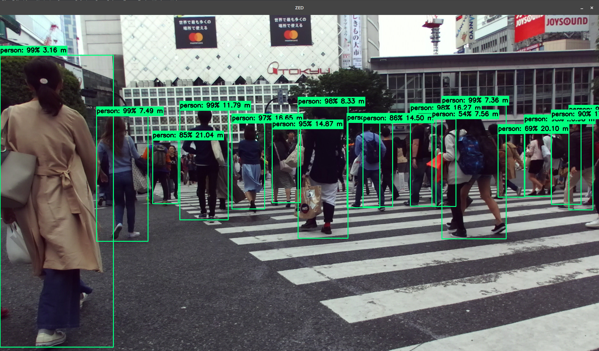

# 3D Object Detection using ZED and Tensorflow 1

The ZED SDK can be interfaced with Tensorflow for adding 3D localization of custom objects detected with Tensorflow Object Detection API.
In this Python 3 sample, we will show you how to detect, classify and locate objects in 3D space using the ZED stereo camera and Tensorflow SSD MobileNet inference model.

<p align="center">
  
</p>

# Installation

## Dependencies

The 3D Object Detection project depends on the following libraries:

* Python 3
* CUDA
* ZED SDK 3
* ZED Python API
* cuDNN
* Tensorflow 1
* Tensorflow Object Detection API
* OpenCV


## Getting Started

### ZED SDK Installation

Install the [ZED SDK](https://www.stereolabs.com/developers/release/) and the ZED [Python API](https://www.stereolabs.com/docs/getting-started/python-development/).

### cuDNN Installation

Install [cuDNN](https://developer.nvidia.com/cudnn). Read the [support](https://docs.nvidia.com/deeplearning/sdk/cudnn-support-matrix/index.html) matrix for the corresponding CUDA and driver version.


### Tensorflow Object Detection API Installation

Install Tensorflow 1 with GPU support by reading the following [instructions](https://www.tensorflow.org/install/) for your target platform.

```bash
# GPU package for CUDA-enabled GPU cards
python -m pip install tensorflow==1.15
```

Install Tensorflow Object Detection API by following these [instructions](https://github.com/tensorflow/models/blob/master/research/object_detection/g3doc/installation.md) and download the model repository.

```bash
git clone https://github.com/tensorflow/models
```

Test that you have correctly installed the Tensorflow Object Detection
API by running the following command:

```bash
python object_detection/builders/model_builder_test.py
```

**Note:** If you get an import error, make sure that tensorflow/models/research/slim directories have been added to PYTHONPATH. This can be done by running the following command:

```bash
# From tensorflow/models/
export PYTHONPATH=$PYTHONPATH:`pwd`:`pwd`/slim
```

## Running the sample

Make sure the virtualenv is active.

```bash
source ~/tensorflow/bin/activate
```

Run the code with python3.

```bash
python3 object_detection_zed.py
```

## Testing other models

In this example, we're using the computationally efficient MobileNet model for detecting objects. You can change this by updating the [MODEL_NAME](https://github.com/stereolabs/zed-tensorflow/blob/master/object_detection_zed.py#L177) variable and selecting another one from Tensorflow model [zoo](https://github.com/tensorflow/models/blob/master/research/object_detection/g3doc/detection_model_zoo.md). These models will be downloaded and extracted automatically. For example, a ResNet model can used by changing `MODEL_NAME` to :

```python
# Full model name required
MODEL_NAME = ssd_resnet50_v1_fpn_shared_box_predictor_640x640_coco14_sync_2018_07_03
```

<!--### Changing the label

Until then only COCO models were loading, the classes names are store in a file ([ms_coco_label](./data/mscoco_label_map.pbtxt)) and loading alongside the model.
This should be changed if the model was trained on a dataset with different classes.

The variable containing the classes label map can be changed [here "`PATH_TO_LABELS`"](./object_detection_zed.py#L202).-->

### Testing a custom model

Other custom object detection models can be loaded by modifying the [PATH_TO_FROZEN_GRAPH](https://github.com/stereolabs/zed-tensorflow/blob/master/object_detection_zed.py#L217), variable typically called `frozen_inference_graph.pb`.


## Running a Docker Container

A DockerFile is provided in the [docker](./docker) folder.


## Notes

### CUDA / cuDNN version

Please refer to the Tensorflow compatibility [table](https://www.tensorflow.org/install/install_sources#tested_build_configurations) to know the appropriate cuDNN and CUDA versions  for a given Tensorflow version. At the moment of writing, Tensorflow requires CUDA 9.0 and cuDNN 7.

### Architecture

This sample uses 2 threads, one for the ZED images capture and one for the Tensorflow detection. While it may seem complex at first, it actually solves 2 issues:

1. Performance is increased, as depth computation is done in parallel to inference.

2. Tensorflow and the ZED SDK uses CUDA GPU computation and therefore requires the use of CUDA contexts. Since we currently can't share the CUDA Context between the ZED and TF, we have to separate the GPU computation. Each CUDA context must therefore have its own thread.

## Support
If you need assistance go to our Community site at https://community.stereolabs.com/
