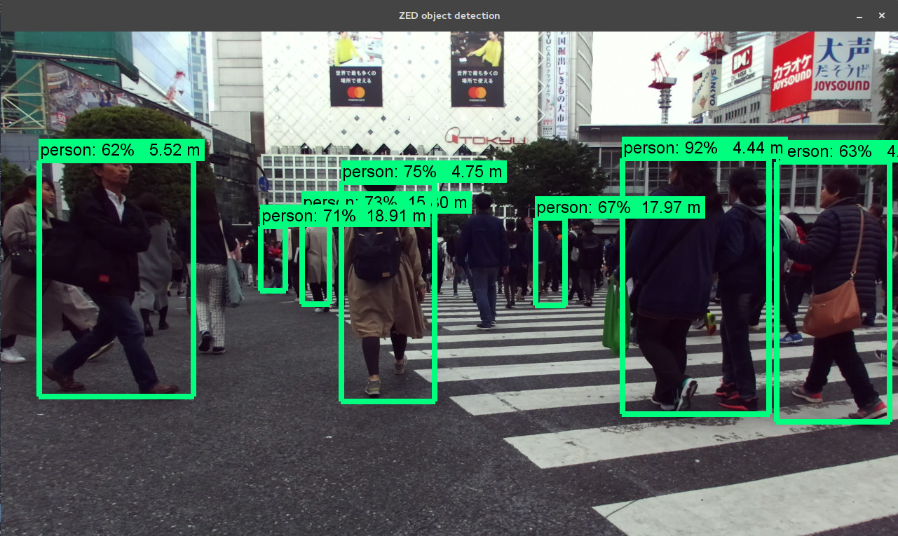

# Object detection using the ZED and Tensorflow

Based on Tensorflow's object detection API tutorial, this Python 3 program will show how to detect, identify and locate objects using the ZED camera and Tensorflow's ssd_mobilenet inference model.





## Dependencies

The project has the following dependencies:

* Python 3
* CUDA
* [ZED SDK](https://www.stereolabs.com/developers/release/latest/)
* [pyzed-python](https://github.com/stereolabs/zed-python) (ZED SDK python wrapper)
* [cuDNN](https://developer.nvidia.com/cudnn)
* [tensorflow-gpu](https://www.tensorflow.org/install/)
* opencv
* [Tensorflow models](https://github.com/tensorflow/models/blob/master/research/object_detection/g3doc/installation.md)

## Tutorial

### Install dependencies

1. [Install the ZED SDK](https://www.stereolabs.com/developers/release/latest/)
2. [Install the python wrapper for the ZED SDK](https://github.com/stereolabs/zed-python)
3. [Install cuDNN](https://developer.nvidia.com/cudnn), be careful of using the correct CUDA version

### Install Tensorflow

Install Tensorflow, ideally tensorflow-gpu by following the instruction for your platform https://www.tensorflow.org/install/

* [Tensorflow GPU for Ubuntu](https://www.tensorflow.org/install/install_linux#tensorflow_gpu_support)
* [Tensorflow GPU for Windows](https://www.tensorflow.org/install/install_windows#requirements_to_run_tensorflow_with_gpu_support)

It should be along the line of:

```bash
pip3 install --upgrade tensorflow-gpu
```

### Install Tensorflow Object Detection API

First download the models repository

    git clone https://github.com/tensorflow/models

Then setup the Tensorflow Object Detection API by following the instructions here :

https://github.com/tensorflow/models/blob/master/research/object_detection/g3doc/installation.md

Make sure the object detection API is in the Python path.

### Run the sample

Make sure the virtualenv is active

```bash
source ~/tensorflow/bin/activate
```

Run the code with python3

```bash
python3 object_detection_zed.py
```

## Notes

### CUDA / cuDNN version

Please refer [to this link](https://www.tensorflow.org/install/install_sources#tested_source_configurations) to know the cuDNN and CUDA versions needed for a given Tensorflow version. At the moment of writing the current versions support CUDA 9.0 and cuDNN 7.

### Architecture

This sample uses 2 threads, one for the ZED images capture and one for the Tensorflow detection. While it may seems more complex at first, it actually solves 2 issues at a time :

1. The performances are increase, the depth computation and the ZED pipeline in general is done in parallel to the inference.

2. Tensorflow and the ZED SDK uses CUDA GPU computation and therefore requires the use of CUDA Context. Since we currently can't share the CUDA Context between the ZED and TF, we have to separates the GPU computation. Each CUDA Context must therefore have his own thread. Another solution (not tested) could be to use something similar [to this](https://github.com/frk2/cuda-fun) based on pop/push before each operations.
